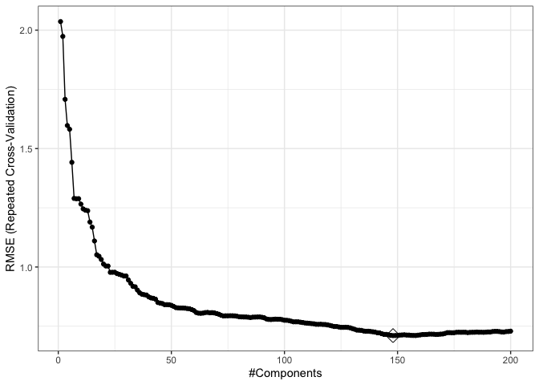
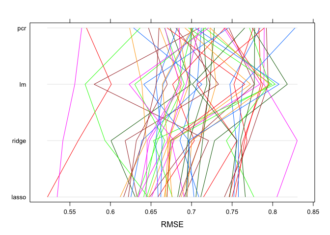
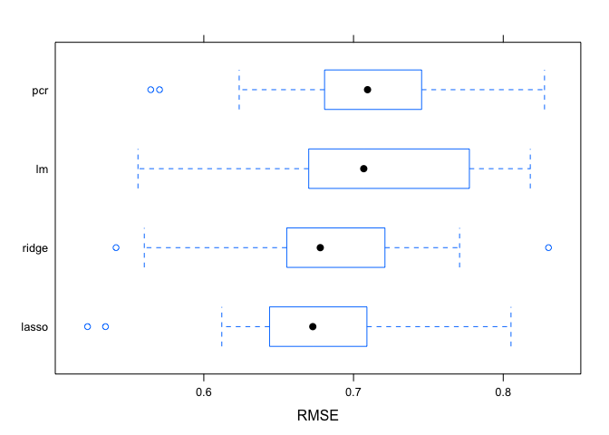

p8160\_hw1\_zl2860
================
Zongchao Liu
2/16/2020

# load data

``` r
set.seed(886)
train = read_csv("./solubility_train.csv")
```

    ## Parsed with column specification:
    ## cols(
    ##   .default = col_double()
    ## )

    ## See spec(...) for full column specifications.

``` r
test = read_csv("./solubility_test.csv")
```

    ## Parsed with column specification:
    ## cols(
    ##   .default = col_double()
    ## )
    ## See spec(...) for full column specifications.

``` r
train_x = model.matrix(Solubility ~ . , train)[,-ncol(train)]
train_y = train$Solubility
test_x = model.matrix(Solubility ~ . , test)[,-ncol(test)]
test_y = test$Solubility
```

# 1\. ls regression

``` r
ctrl1  = trainControl(method = "repeatedcv", number = 10, repeats = 5)
lm.fit = train(train_x, 
               train_y,
               method = "lm",
               trControl = ctrl1)

pred_test_fit = predict(lm.fit,newx = test_x)
mse(test_y,pred_test_fit)
```

    ## [1] 10.45059

\#2. ridge

``` r
ridge.fit = train(x = train_x,
                  y = train_y,
                  method = "glmnet",
                  tuneGrid = expand.grid(alpha = 0,
                                         lambda = exp(seq(-10,5,length = 100))),
                  trControl = ctrl1)

plot(ridge.fit,xTrans = function(x) log(x))
```

<!-- -->

# 3 . lasso

``` r
set.seed(886)
lasso.fit = train(train_x,
                  train_y,
                  method = "glmnet",
                  tuneGrid = expand.grid(alpha = 1,
                                         lambda = exp(seq(-6,-4,length = 200))),
                  preProc = c("center","scale"),
                  trControl = ctrl1)
log(0.0006)
```

    ## [1] -7.418581

``` r
lasso.fit$bestTune
```

    ##    alpha      lambda
    ## 76     1 0.005267333

``` r
plot(lasso.fit, xTrans = function(x) log(x))
```

<!-- -->

``` r
coef = coef(lasso.fit$finalModel,lasso.fit$bestTune$lambda)
```

# d. pcr

``` r
set.seed(886)
pcr.fit <- train(x = train_x, 
                 y = train_y,
                 method = "pcr",
                 tuneLength = 200,
                 trControl = ctrl1,
                 preProc = c("center", "scale"))

trans <- preProcess(train_x, method = c("center", "scale"))

predy2.pcr2 <- predict(pcr.fit$finalModel, newdata = predict(trans, test_x),ncomp = pcr.fit$bestTune$ncomp)


mse(test_y, predy2.pcr2)
```

    ## [1] 0.5541437

``` r
ggplot(pcr.fit, highlight = T) + theme_bw()
```

<!-- -->

# 

``` r
resamp = resamples(list(lasso = lasso.fit,
                        ridge = ridge.fit,
                        pcr = pcr.fit,
                        lm = lm.fit))

summary(resamp)
```

    ## 
    ## Call:
    ## summary.resamples(object = resamp)
    ## 
    ## Models: lasso, ridge, pcr, lm 
    ## Number of resamples: 50 
    ## 
    ## MAE 
    ##            Min.   1st Qu.    Median      Mean   3rd Qu.      Max. NA's
    ## lasso 0.4115866 0.4900738 0.5143649 0.5187090 0.5507472 0.5932016    0
    ## ridge 0.4292700 0.4920280 0.5244631 0.5265594 0.5566193 0.6517288    0
    ## pcr   0.4450885 0.5263199 0.5474123 0.5491592 0.5749654 0.6292020    0
    ## lm    0.4169541 0.4977571 0.5231366 0.5305369 0.5696136 0.6216343    0
    ## 
    ## RMSE 
    ##            Min.   1st Qu.    Median      Mean   3rd Qu.      Max. NA's
    ## lasso 0.5223360 0.6440894 0.6727906 0.6776355 0.7080456 0.8051749    0
    ## ridge 0.5678490 0.6464206 0.6790817 0.6903113 0.7271180 0.8646868    0
    ## pcr   0.5562166 0.6858456 0.7160245 0.7143037 0.7424869 0.8271264    0
    ## lm    0.5492599 0.6759606 0.7084278 0.7104343 0.7670941 0.8119781    0
    ## 
    ## Rsquared 
    ##            Min.   1st Qu.    Median      Mean   3rd Qu.      Max. NA's
    ## lasso 0.8342757 0.8755701 0.8909826 0.8905513 0.9029722 0.9382580    0
    ## ridge 0.8366747 0.8720422 0.8892880 0.8864979 0.9039552 0.9197481    0
    ## pcr   0.8247221 0.8681898 0.8812373 0.8791624 0.8904903 0.9326075    0
    ## lm    0.8290734 0.8589206 0.8781836 0.8806380 0.8988242 0.9405553    0

``` r
parallelplot(resamp,metric = "RMSE")
```

<!-- -->

``` r
bwplot(resamp, metric = "RMSE")
```

<!-- -->
