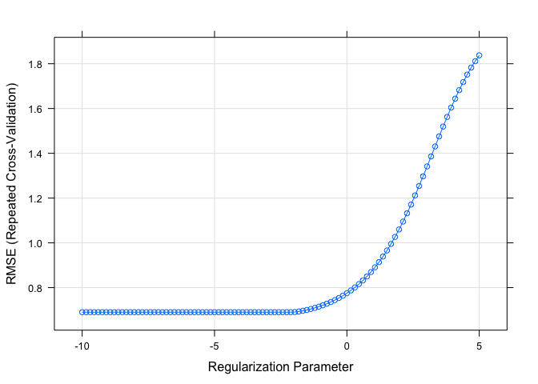
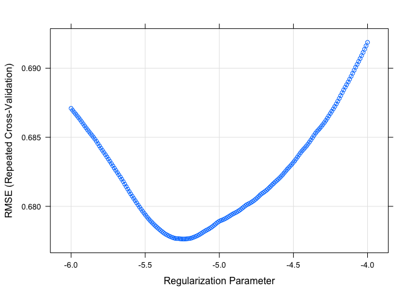

p8160\_hw1\_zl2860
================
Zongchao Liu
2/16/2020

# load data

``` r
train = read_csv("./solubility_train.csv")
```

    ## Parsed with column specification:
    ## cols(
    ##   .default = col_double()
    ## )

    ## See spec(...) for full column specifications.

``` r
test = read_csv("./solubility_test.csv")
```

    ## Parsed with column specification:
    ## cols(
    ##   .default = col_double()
    ## )
    ## See spec(...) for full column specifications.

# 1\. ls regression

``` r
fit_ls = lm(Solubility ~. ,data = train)
#summary(fit_ls)
pred_train = predict(fit_ls,train)
#mse train
#ModelMetrics::mse(train$Solubility, pred_train)
#mse test
pred_test = predict(fit_ls,test)
ModelMetrics::mse(test$Solubility, pred_test)
```

    ## [1] 0.5558898

\#2. ridge

``` r
set.seed(888)
x = model.matrix(Solubility ~ . , train)[,-1]
y = train$Solubility


fit_ridge = glmnet(x , 
                   y ,
                   standardize = TRUE,
                   alpha = 0,
                   lambda = exp(seq(-10,-2,length= 100)))

cv.fit = cv.glmnet(x,y, type.measure = "mse", alpha = 0, lambda = exp(seq(-10,-2,length= 100)))
plot(cv.fit)
```

<!-- -->

``` r
best.lambda = cv.fit$lambda.min

test_x = model.matrix(Solubility ~. , test)[,-1]
pred_test_ridge = predict(fit_ridge, s = best.lambda,newx = test_x)


# ridge regression test MSE
ModelMetrics::mse(test$Solubility, pred_test_ridge)
```

    ## [1] 0.5112384

# 3 . lasso

``` r
x = model.matrix(Solubility ~ . , train)[,-1]
y = train$Solubility


fit_lasso = glmnet(x , 
                   y ,
                   standardize = TRUE,
                   alpha = 1,
                   lambda = exp(seq(-10,-2,length= 100)))

cv.fit.lasso = cv.glmnet(x,y, type.measure = "mse", alpha = 1, lambda = exp(seq(-10,-2,length= 100)))
plot(cv.fit.lasso)
```

<!-- -->

``` r
best.lambda = cv.fit$lambda.min

test_x = model.matrix(Solubility ~. , test)[,-1]
pred_test_lasso = predict(fit_lasso, s = best.lambda,newx = test_x)

# ridge regression test MSE
ModelMetrics::mse(test$Solubility, pred_test_lasso)
```

    ## [1] 0.7017033
